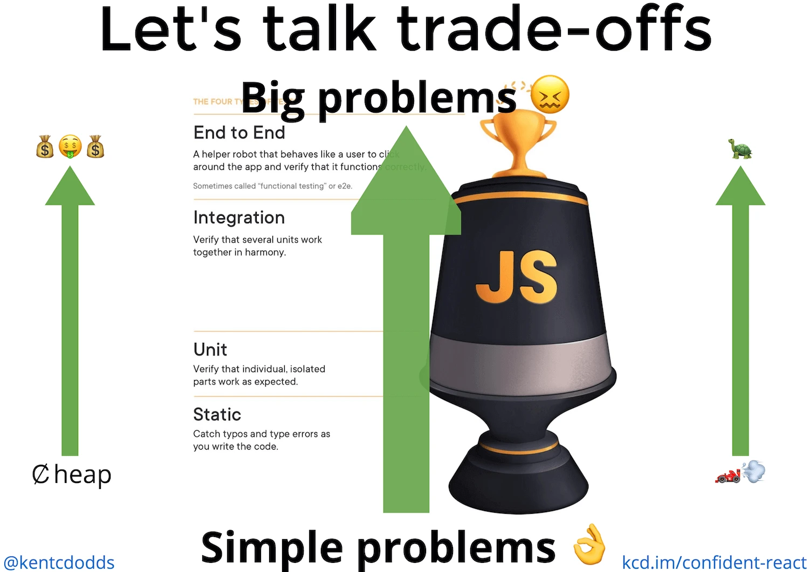

<!-- prettier-ignore-start -->
# Tests frontend

## Pourquoi écrire des tests

Note:

- Parce que c'est une "bonne pratique"
- Parce que mon manager/lead dev me le demande
- Parce que je suis objectivé sur le taux de couverture
- Parce que ça va faciliter les futures modifications (maintenance/évolution/refactorisation)
- Parce que ça documente ce que mon code doit faire
- Parce que ça augmente ma confiance dans le code que je livre en production

## Quels test écrire ?

L'écriture d'un test est un investissement, il doit avoir un ROI.

### ROI des différents types de tests

### ROI des différents types de tests

Note:

- Vers le haut du graphe plus de coûts et tests plus lents
- On capte des petits problèmes en bas et des problèmes complexes en haut

### Analyse statique

- Détecter des erreurs possibles pendant la frappe
- Inciter les développeurs à se poser les bonnes questions
- Enforcer une uniformité des pratiques
- Diminue la charge de travail lors des revues de code

### Tests unitaires

- À faire sur les couches de service et les composants réutilisables
- Peut servir de spécification du comportement attendu
- Permet de tester facilement tous les chemins de code
- Rend difficile les refactorisations
- Sera probablement à réécrire/modifier à chaque modification du code

### Tests d'intégration

- À faire au niveau de la fonctionnalité
- On teste le comportement
- Meilleur ROI parmi les types de test

### Tests E2E

- Permet de capter des erreurs issues de l'extérieur (par exemple serveur backend)
- À faire au niveau du parcours
- Nécessite un environnement complet et fonctionnel pour tourner

### Autres types de test

- Tests de non-régression visuelle
- Monitoring de parcours en production

### Alors on fait quoi ?

- On combine les différents modes de test
- On adapte le niveau de détail du test
- On fait des **compromis**

### Outils

- Statique: ESLint + Typescript
- Unitaires: Jest
- Integration: Jest + *-testing-library
- E2E: Cypress

### Des tests frontend plus efficace

Voir ppt.

<!-- prettier-ignore-end -->
